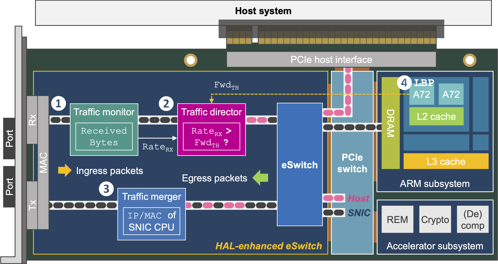

# Artifact Evaluation for "HAL: Hardware-assisted Load Balancing for Energy-efficient SNIC-Host Cooperative Computing", ISCA 2024.

In this section, we provide instructions to reproduce key experimental results shown in the paper. There are three key sets of experiments: (1) experiments that evaluate the throughput, 99th-percentile (p99) latency, power consumption, and energy efficiency of a server using the host processor and the SNIC processor, respectively, for processing given benchmarks (or functions) (Fig. 2, Fig. 3, and Fig. 4); (2) experiments that evaluate the impact of software-based load balancing on throughput and p99 latency (Fig. 5); (3) experiments that show benefits realized by using hardware-assisted load balancing (HAL) (Fig. 9).

<p align="center">
  
</p>

## 🔩 Requirements
Hardware
* A server with 100 Gbps NVIDIA BlueField-2 SmartNIC, we tested with Intel Xeon Gold 6140 (Skylake)
* A client with 100 Gbps ConnectX-6 Dx NIC, we tested with Intel Xeon E5-2660 v4 (Broadwell)
* Xilinx Alveo U280 FPGA
* Intel c62x QAT adapter

Software
* NVIDIA DOCA 1.5.0
* Xilinx Vivado 2023.1
* Intel QAT Driver HW Version 1.X - 4.22.0-00001

## 📖 Contents
* `1_fpga_src` includes code for HAL FPGA implementation
* `2_sw_src` includes code for HAL software implemenation
* `3_benchmark` includes benchmarks on host/SNIC CPU and host/SNIC accelerator
* `4_script` includes scripts to reproduce figures 2,3,4,5,9

## 🚀 Experiment Workflow
1. Follow `software_install.md` to install software dependencies 
2. Follow `1_fpga_src/README.md` to compile and program FPGA
3. Put password to `env_setup.sh`; Run `env_setup.sh` and `compile.sh` in `4_script/common` to set up environment and compile code
```bash
source 4_script/common/env_setup.sh
bash 4_script/common/compile.sh
```
4. Run `check_connection.sh` to check connection between client and SNIC/host
```bash
bash 4_script/common/check_connection.sh
```
5. Run experiments

Option 1: Follow `4_script/fig*/README.md` to run experiments for all the figures together:
```bash
cd 4_script/quick_run
bash run_all_fig.sh <run_name>
bash process_results_all_fig.sh <run_name>
bash draw_all_fig.sh <run_name>
feh ../fig*/fig*.png
```
Option 2: Follow `4_script/fig*/README.md` for details about experiments to reproduce each figure. The general steps are as follows:
```bash
cd 4_script/fig*
bash run_fig*.sh
python3 ../common/process_result.py results results/output.csv
python3 draw_fig*.py results/output.csv
feh fig*.png
```

<!-- ## 📚 Citation
```bibtex
@inproceedings{
}
``` -->